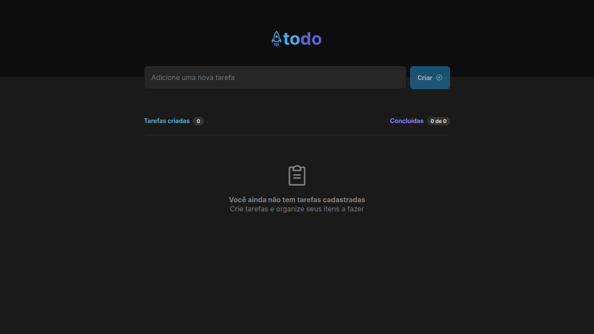
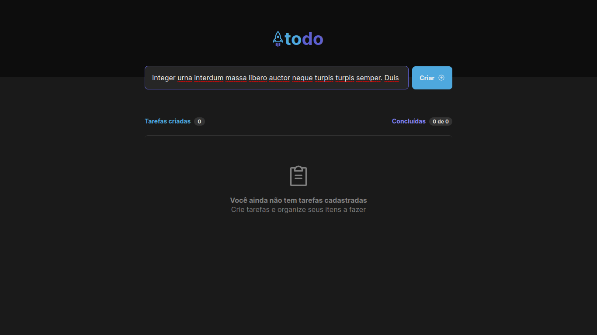
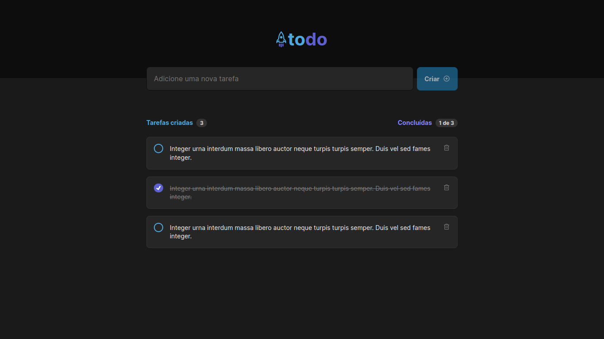

<p align="center">
   <a href="https://www.linkedin.com/in/arilsonsouza/">
      
   </a>

  
</p>

> Primeiro desafio da trilha de React do Ignite - 2022 da [Rocketseat](https://github.com/Rocketseat). O projeto consiste em adicionar, marcar e remover To Do's.

# :pushpin: Conteúdo

- [Tecnologias](#computer_tecnologias)
- [Executando](#construction_worker-executando)
- [Screenshots](#construction_screenshots)

# :computer: Tecnologias

Este projeto foi feito utilizando as seguintes tecnologias:

- [React](https://reactjs.org/)
- [Typescript](https://www.typescriptlang.org/)
- [Vite](https://vitejs.dev/)
# :construction_worker: Executando

```bash
# Clone o Repositório
https://github.com/arilsonsouza/ignite-reactjs-2022-desafio-1.git
```

```bash
# Baixe as dependendências
$ yarn
```

```bash
# Execute
$ yarn dev
```

Acesse <http://localhost:3000> para ver o resultado.

# :camera: Screenshots



